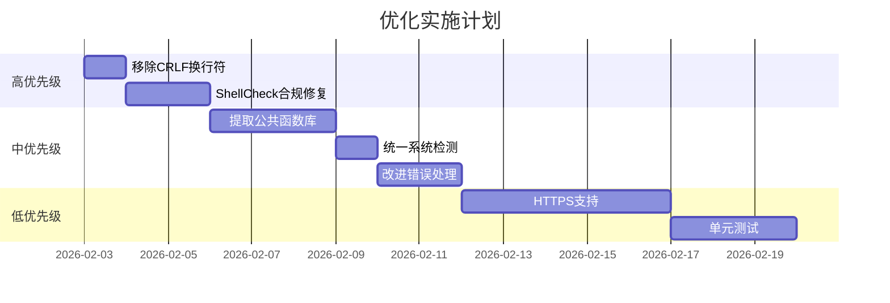

# hia-realm 项目代码优化计划

**创建日期**: 2026-02-03  
**状态**: 待确认

---

## 📊 优化概览

| 类别 | 优化项数 | 影响范围 |
|------|---------|----------|
| 🏗️ 代码架构 | 5 | 高 |
| 🔧 功能增强 | 4 | 中 |
| 🛡️ 安全强化 | 3 | 高 |
| 📦 依赖管理 | 2 | 低 |
| 📝 代码质量 | 4 | 中 |

---

## 🏗️ 代码架构优化

### 1. 提取公共函数库
**问题**: `install.sh`、`quickpanel.sh`、`panel.sh` 存在大量重复代码

**重复代码示例**:
- 颜色定义 (`GREEN`, `RED`, `YELLOW`, `RESET`)
- `check_root()` / root 权限检查
- `get_arch()` / 架构检测
- `get_libc()` / libc 类型检测
- `need_cmd()` / 命令依赖检查

**优化方案**:
```bash
# 创建 lib/common.sh
#!/bin/bash
# 公共函数库

# 颜色定义
export GREEN="\033[32m"
export RED="\033[31m"
export YELLOW="\033[33m"
export CYAN="\033[36m"
export RESET="\033[0m"

# 通用函数
check_root() { ... }
get_arch() { ... }
get_libc() { ... }
need_cmd() { ... }
```

**收益**: 减少约 200 行重复代码，便于维护

---

### 2. 统一系统检测逻辑
**问题**: `install.sh` 和 `port-traffic-dog.sh` 使用不同的系统检测方法

**当前状态**:
```bash
# install.sh 使用
if [ -f /etc/debian_version ]; then ...
elif [ -f /etc/redhat-release ]; then ...

# port-traffic-dog.sh 使用
detect_system() {
    if [ -f /etc/lsb-release ] && grep -q "Ubuntu" ...; then
        echo "ubuntu"
    ...
}
```

**优化方案**: 统一使用 `detect_system()` 函数，返回标准化系统类型

---

### 3. panel.sh BOM 问题根本修复
**问题**: `panel.sh` 第 1 行仍有 BOM 字符 ``

**当前状态**: 文件开头是 `#!/bin/bash`

**优化方案**: 使用正确的 UTF-8 无 BOM 编码重新保存

---

## 🔧 功能增强

### 4. 添加版本检查和自动更新
**问题**: 脚本缺少版本管理机制

**优化方案**:
```bash
# 在脚本头部添加版本号
readonly SCRIPT_VERSION="1.0.0"
readonly REMOTE_VERSION_URL="https://raw.githubusercontent.com/wsuming97/realm-suming/master/version.txt"

check_update() {
    local remote_ver=$(curl -s "$REMOTE_VERSION_URL" 2>/dev/null)
    if [ "$remote_ver" != "$SCRIPT_VERSION" ]; then
        echo -e "${YELLOW}发现新版本: $remote_ver (当前: $SCRIPT_VERSION)${RESET}"
        read -p "是否更新？[y/N]: " ans
        # ...
    fi
}
```

---

### 5. 改进错误处理和日志
**问题**: 部分操作失败时没有详细错误信息

**优化方案**:
```bash
# 添加日志函数
LOG_FILE="/var/log/realm-install.log"

log_info() { echo "[$(date '+%Y-%m-%d %H:%M:%S')] INFO: $*" | tee -a "$LOG_FILE"; }
log_error() { echo "[$(date '+%Y-%m-%d %H:%M:%S')] ERROR: $*" | tee -a "$LOG_FILE" >&2; }
log_warn() { echo "[$(date '+%Y-%m-%d %H:%M:%S')] WARN: $*" | tee -a "$LOG_FILE"; }

# 使用示例
if ! curl -L -o realm.tar.gz "$url"; then
    log_error "下载失败: $url"
    exit 1
fi
```

---

### 6. 添加健康检查功能
**问题**: 缺少服务健康检查机制

**优化方案**:
```bash
health_check() {
    local service=$1
    if systemctl is-active --quiet "$service"; then
        echo -e "${GREEN}✓ $service 运行正常${RESET}"
        return 0
    else
        echo -e "${RED}✗ $service 未运行${RESET}"
        return 1
    fi
}

# 综合健康检查
full_health_check() {
    health_check realm
    health_check realm-panel
    # 检查端口监听
    # 检查配置文件有效性
}
```

---

### 7. 添加配置验证
**问题**: 配置文件修改后没有验证机制

**优化方案**:
```bash
validate_config() {
    local config_file="$1"
    
    # 检查 TOML 语法
    if ! python3 -c "import toml; toml.load('$config_file')" 2>/dev/null; then
        # 备用方案：使用 realm --check
        if ! $REALM_BIN -c "$config_file" --dry-run 2>/dev/null; then
            log_error "配置文件语法错误"
            return 1
        fi
    fi
    return 0
}
```

---

## 🛡️ 安全强化

### 8. 强制修改默认密码
**问题**: 用户可能一直使用默认密码 `123456`

**优化方案**:
```bash
# 首次登录强制修改密码
# 在 panel 的 Rust 代码中添加
if is_default_password() {
    redirect_to_password_change();
}
```

---

### 9. 添加 HTTPS 支持
**问题**: 面板默认使用 HTTP，API Token 明文传输

**优化方案**:
- 添加自签名证书生成功能
- 支持 Let's Encrypt 自动证书
- 配置 HTTPS 端口选项

---

### 10. 添加 IP 白名单
**问题**: 面板对所有 IP 开放

**优化方案**:
```rust
// 在 Rust 面板代码中添加
let allowed_ips = load_ip_whitelist();
if !allowed_ips.is_empty() && !allowed_ips.contains(&client_ip) {
    return Err(StatusCode::FORBIDDEN);
}
```

---

## 📦 依赖管理

### 11. 添加离线安装支持
**问题**: 所有安装都需要网络连接

**优化方案**:
```bash
# 支持离线包安装
install_offline() {
    local package_path="$1"
    if [ -f "$package_path/realm" ]; then
        cp "$package_path/realm" "$REALM_BIN"
        # ...
    fi
}
```

---

### 12. 预检查网络连通性
**问题**: 下载失败时错误信息不够明确

**优化方案**:
```bash
check_connectivity() {
    local urls=(
        "https://api.github.com"
        "https://raw.githubusercontent.com"
    )
    for url in "${urls[@]}"; do
        if ! curl -s --connect-timeout 5 "$url" >/dev/null; then
            log_error "无法连接: $url"
            return 1
        fi
    done
    return 0
}
```

---

## 📝 代码质量

### 13. 添加 ShellCheck 合规
**问题**: 部分脚本存在 ShellCheck 警告

**主要问题**:
- 未引用的变量
- 使用 `[ ]` 而不是 `[[ ]]`
- 管道中的变量作用域

**优化方案**: 运行 ShellCheck 并修复所有警告

---

### 14. 统一代码风格
**问题**: 不同文件的代码风格不一致

**优化方案**:
- 统一缩进（4 空格）
- 统一函数命名（snake_case）
- 统一注释格式
- 添加 `.editorconfig` 文件

---

### 15. 添加单元测试
**问题**: 没有测试覆盖

**优化方案**:
```bash
# tests/test_common.sh
#!/bin/bash
source ../lib/common.sh

test_get_arch() {
    local arch=$(get_arch)
    assert_not_empty "$arch"
    assert_in "$arch" "x86_64 aarch64 armv7 unsupported"
}

# 运行测试
run_tests
```

---

### 16. 移除 Windows 换行符
**问题**: 所有文件使用 CRLF 换行符

**当前状态**: 文件中包含 `\r\n`

**优化方案**:
```bash
# 转换为 Unix 换行符
dos2unix *.sh
# 或
sed -i 's/\r$//' *.sh
```

---

## 🎯 优化优先级建议

### 高优先级（立即修复）
1. ✅ panel.sh BOM 字符问题
2. 🔄 移除 Windows 换行符 (CRLF → LF)
3. 🔄 ShellCheck 合规修复

### 中优先级（近期优化）
4. 提取公共函数库
5. 统一系统检测逻辑
6. 改进错误处理和日志

### 低优先级（长期改进）
7. 添加 HTTPS 支持
8. 添加单元测试
9. 添加离线安装支持

---

## 📋 实施计划



---

## 🤔 需要确认的问题

1. **是否需要保持向后兼容？** 部分优化可能影响现有安装
2. **是否接受 Python 依赖？** 配置验证可能需要 Python
3. **HTTPS 证书方案偏好？** 自签名 vs Let's Encrypt
4. **是否需要 CI/CD 集成？** GitHub Actions 自动测试

---

请告诉我您希望优先实施哪些优化，或者是否有其他优化需求？
