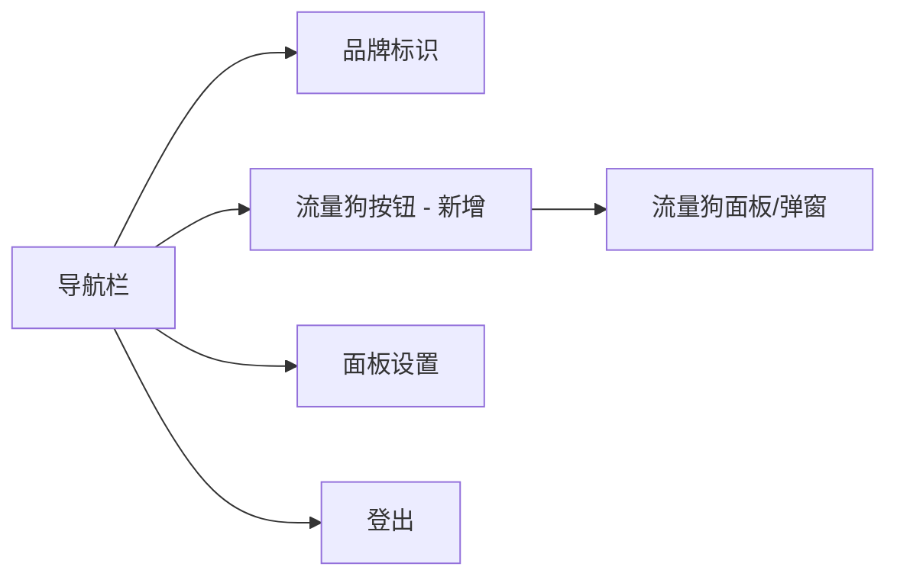
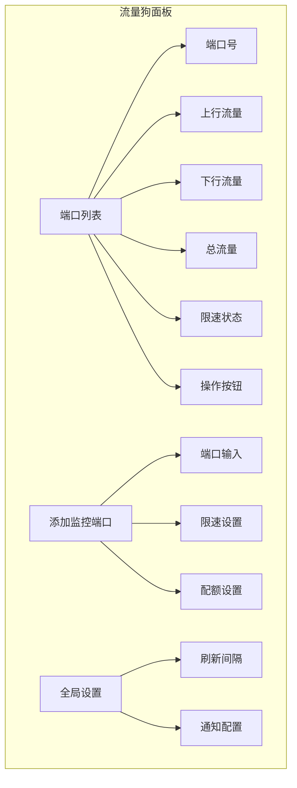
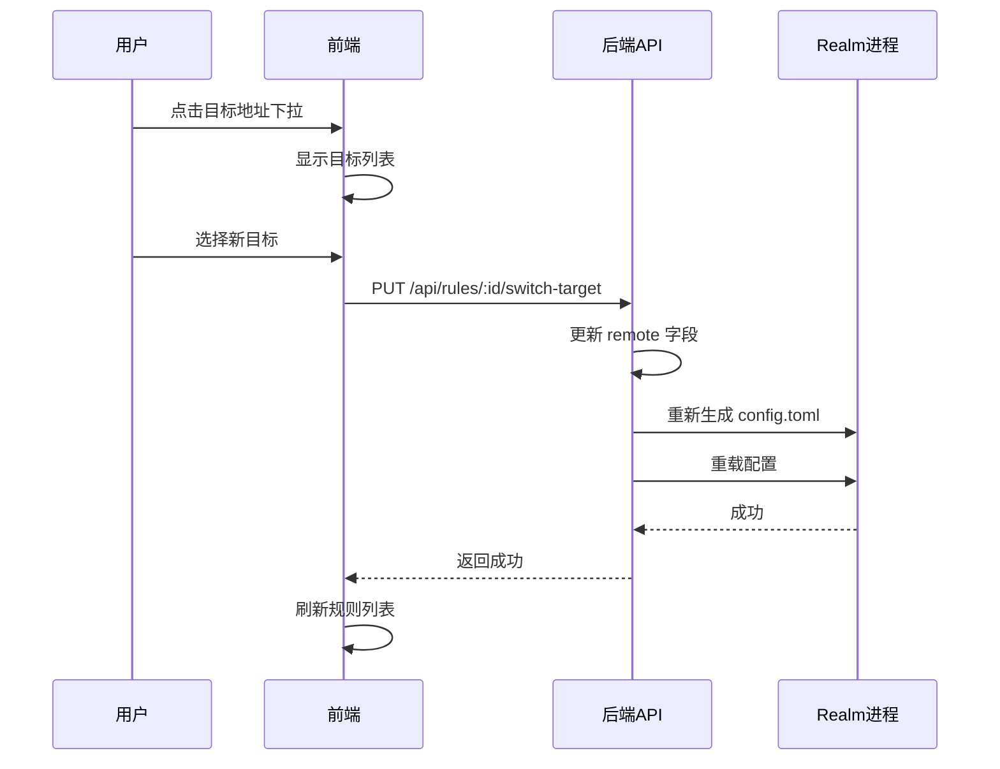

# Web 面板 UI 增强计划

## 📋 概述

本计划包含两个主要功能增强：
1. **端口流量狗集成** - 在面板中添加流量狗入口
2. **多 IP 切换功能** - 支持规则配置多个目标 IP 并快速切换

---

## 🎯 功能一：端口流量狗面板集成

### 当前状态分析

从 panel.sh 代码分析，当前面板结构如下：

```
导航栏 (navbar)
├── 品牌标识: "Realm 转发面板"
├── 面板设置按钮
└── 登出按钮

主内容区
├── 输入区域 (card-fixed)
│   ├── 备注名称输入
│   ├── 监听端口输入
│   ├── 目标地址输入
│   ├── 添加按钮
│   └── 工具组: 批量, 全删, 导出, 导入
│
└── 规则列表 (card-scroll)
    └── 规则表格
```

### 设计方案

#### 方案 A：导航栏添加流量狗按钮（推荐）

在导航栏添加一个"流量狗"按钮，点击后打开流量狗管理界面。



**UI 修改位置** (panel.sh 第 1533 行附近):
```html
<!-- 在 nav-actions 中添加 -->
<button class="btn btn-gray" onclick="openTrafficDog()">
  <i class="fas fa-dog"></i> 
  <span class="nav-text">流量狗</span>
</button>
```

#### 方案 B：设置弹窗添加 Tab

在面板设置弹窗中添加一个新的 Tab 页。

**当前 Tab**: 管理账户 | 个性背景 | 通知设置 | 远程节点
**新增 Tab**: 管理账户 | 个性背景 | 通知设置 | 远程节点 | **流量狗**

### 流量狗界面设计



### 后端 API 设计

需要在 Rust 代码中添加新的 API 端点：

| 端点 | 方法 | 功能 |
|------|------|------|
| `/api/traffic-dog/ports` | GET | 获取所有监控端口 |
| `/api/traffic-dog/ports` | POST | 添加监控端口 |
| `/api/traffic-dog/ports/:port` | DELETE | 删除监控端口 |
| `/api/traffic-dog/stats` | GET | 获取流量统计 |
| `/api/traffic-dog/limit/:port` | POST | 设置端口限速 |

### 实施步骤

1. 修改 panel.sh HTML 部分，添加流量狗按钮
2. 添加流量狗弹窗 Modal HTML
3. 添加流量狗相关 JavaScript 函数
4. 添加 Rust 后端 API 端点
5. 集成 nftables 流量读取逻辑

---

## 🎯 功能二：多 IP 切换功能

### 需求分析

用户希望一个转发规则可以配置多个目标 IP，并能在面板上快速切换，而不需要每次手动修改。

**使用场景**：
- 主备切换：当主服务器故障时快速切换到备用
- 多线路切换：根据网络状况切换不同线路
- 测试环境切换：开发/测试/生产环境快速切换

### 数据结构修改

当前 Rule 结构：
```rust
struct Rule {
    id: String,
    name: String,
    listen: String,
    remote: String,  // 单个目标
    // ...其他字段
}
```

修改为：
```rust
struct Rule {
    id: String,
    name: String,
    listen: String,
    remote: String,           // 当前活跃目标
    remote_list: Vec<RemoteTarget>,  // 多目标列表 (新增)
    // ...其他字段
}

struct RemoteTarget {
    address: String,    // IP:端口
    label: String,      // 标签/备注
    is_active: bool,    // 是否当前活跃
}
```

### UI 设计

#### 规则列表显示

在规则行的"目标"列添加下拉选择器或切换按钮：

```
| 状态 | 备注 | 监听 | 目标                              | 流量 | 操作 |
|------|------|------|-----------------------------------|------|------|
| 🟢   | 节点A | :443 | [1.2.3.4:443 ▼] (主) (备1) (备2) | 10GB | ...  |
```

#### 编辑规则弹窗

修改编辑弹窗，添加多目标管理：

```
┌─────────────────────────────────────────┐
│ 编辑规则                                │
├─────────────────────────────────────────┤
│ 备注: [节点A                          ] │
│ 监听: [0.0.0.0:443                    ] │
│                                         │
│ 目标地址列表:                           │
│ ┌─────────────────────────────────────┐ │
│ │ ● 1.2.3.4:443    [主线路]    [删除] │ │
│ │ ○ 5.6.7.8:443    [备用1]     [删除] │ │
│ │ ○ 9.10.11.12:443 [备用2]     [删除] │ │
│ └─────────────────────────────────────┘ │
│ [+ 添加目标]                            │
│                                         │
│ 到期时间: [                           ] │
│ 流量限制: [                           ] │
│                                         │
│                    [取消]  [保存]       │
└─────────────────────────────────────────┘
```

### 快速切换设计

在规则列表中，点击目标地址可以展开下拉菜单进行快速切换：



### 后端 API 设计

| 端点 | 方法 | 功能 |
|------|------|------|
| `/api/rules/:id/targets` | GET | 获取规则的目标列表 |
| `/api/rules/:id/targets` | POST | 添加目标到列表 |
| `/api/rules/:id/targets/:idx` | DELETE | 删除指定目标 |
| `/api/rules/:id/switch-target` | POST | 切换活跃目标 |

### 实施步骤

1. 修改 Rule 结构体，添加 remote_list 字段
2. 修改 JSON 数据读写逻辑
3. 修改 config.toml 生成逻辑
4. 添加新的 API 端点
5. 修改前端 HTML/CSS
6. 添加前端 JavaScript 逻辑
7. 测试切换功能和配置重载

---

## 📁 文件修改清单

| 文件 | 修改内容 |
|------|----------|
| `panel.sh` | 添加流量狗 UI、多 IP 切换 UI、新 API 端点、Rust 数据结构修改 |
| `README.md` | 添加新功能文档说明 |

### panel.sh 修改详情

#### 1. HTML 部分修改 (第 1519-1599 行)

- 导航栏添加流量狗按钮
- 添加流量狗 Modal
- 修改规则编辑 Modal，添加多目标管理
- 修改规则列表显示，添加目标切换下拉

#### 2. JavaScript 部分修改 (第 1540-1599 行)

- 添加 `openTrafficDog()` 函数
- 添加 `loadTrafficStats()` 函数
- 修改 `openEdit()` 函数，支持多目标
- 添加 `addRemoteTarget()` 函数
- 添加 `switchTarget()` 函数

#### 3. Rust 后端修改 (第 700-1100 行)

- 修改 `Rule` 结构体
- 添加 `RemoteTarget` 结构体
- 添加流量狗相关 API 处理函数
- 添加目标切换 API 处理函数

---

## 🔧 技术实现细节

### 流量狗集成 - nftables 查询

```rust
// 读取 nftables 流量统计
fn get_nftables_stats(port: &str) -> (u64, u64) {
    let output = Command::new("nft")
        .args(&["list", "chain", "inet", "port_traffic_dog", &format!("port_{}", port)])
        .output()
        .expect("Failed to execute nft");
    
    // 解析输出获取 bytes 计数
    // ...
}
```

### 多目标切换 - 配置重载

```rust
// 切换目标后重新生成配置
async fn switch_target(
    State(state): State<Arc<AppState>>,
    Path((id, target_idx)): Path<(String, usize)>,
) -> Response {
    let mut data = state.data.lock().unwrap();
    
    if let Some(rule) = data.rules.iter_mut().find(|r| r.id == id) {
        if target_idx < rule.remote_list.len() {
            // 更新活跃目标
            for (i, t) in rule.remote_list.iter_mut().enumerate() {
                t.is_active = i == target_idx;
            }
            rule.remote = rule.remote_list[target_idx].address.clone();
            
            // 保存并重载配置
            save_json(&data);
            save_config_toml(&data);
            reload_realm();
        }
    }
    
    Json(json!({"status": "ok"})).into_response()
}
```

---

## ⚠️ 注意事项

1. **向后兼容**：remote_list 为空时，使用 remote 字段作为唯一目标
2. **配置迁移**：升级时自动将现有 remote 迁移到 remote_list
3. **并发控制**：切换目标时需要锁定防止并发修改
4. **重载优化**：批量切换时合并重载操作

---

## ✅ 验收标准

### 流量狗集成

- [ ] 面板导航栏显示流量狗按钮
- [ ] 点击按钮可打开流量狗管理界面
- [ ] 可查看各端口流量统计
- [ ] 可添加/删除监控端口
- [ ] 可设置端口限速

### 多 IP 切换

- [ ] 编辑规则时可添加多个目标地址
- [ ] 每个目标可设置标签
- [ ] 规则列表显示当前活跃目标
- [ ] 可快速切换目标（无需进入编辑模式）
- [ ] 切换后自动重载 Realm 配置
- [ ] 向后兼容现有规则数据

---

## 📅 实施顺序

1. **第一阶段**：多 IP 切换功能
   - 数据结构修改
   - 后端 API
   - 前端 UI

2. **第二阶段**：流量狗面板集成
   - UI 入口
   - 流量统计展示
   - 端口管理功能

---

## 🚀 执行指令

准备就绪后，切换到 Code 模式执行以下任务：

```
1. 修改 panel.sh 中的 Rule 结构体，添加 remote_list 字段
2. 添加 RemoteTarget 结构体
3. 修改 JSON 序列化/反序列化逻辑
4. 添加 switch_target API 端点
5. 修改前端编辑弹窗 HTML
6. 添加前端多目标管理 JavaScript
7. 添加规则列表目标切换下拉
8. 添加流量狗导航按钮和弹窗
9. 测试功能
10. 更新 README.md
```
