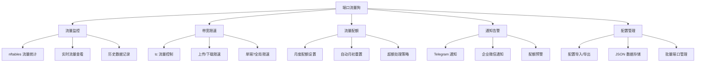

# 端口流量狗集成计?

## 概述

?realm-xwPF 项目中的"端口流量?(Port Traffic Dog) 功能集成到本?hia-realm 项目中?

## 功能分析

### 端口流量狗核心功?



### 技术依?

| 组件 | 用?| 必需?|
|------|------|--------|
| nftables | 流量统计 | 必需 |
| tc | 带宽限?| 必需 |
| jq | JSON 解析 | 必需 |
| curl | API 通知 | 可?|
| cron | 定时任务 | 必需 |

### 数据存储路径

```
/etc/realm/port_traffic_dog/
├── config.json          # 主配置文?
├── ports/               # 端口配置目录
?  ├── 8080.json       # 单端口配?
?  └── 8443.json
├── traffic_data/        # 流量数据目录
?  ├── 8080.dat        # 端口流量记录
?  └── 8443.dat
└── logs/               # 日志目录
    └── traffic.log
```

## 集成方案

### 方案一：独立脚本模式（推荐?

?port-traffic-dog.sh 作为独立脚本添加到项目中，通过主菜单调用?

**优点**?
- 最小化对现有代码的修改
- 保持代码模块?
- 易于维护和更?
- 与原项目兼容性好

**修改范围**?
1. 添加 `port-traffic-dog.sh` 文件
2. 修改 `install.sh` 添加菜单入口
3. 更新 `README.md` 文档


### 方案二：深度集成模式

将流量狗功能直接整合?install.sh 中?

**优点**?
- 统一的用户体?
- 代码更紧?

**缺点**?
- 大幅增加 install.sh 代码量（?3000+ 行）
- 维护困难
- 与上游项目同步困?

### 推荐：方案一

## 实施步骤

### 步骤 1：创?port-traffic-dog.sh

将用户提供的完整代码保存?`port-traffic-dog.sh`?

**代码调整**?
1. 修改数据存储路径以与 hia-realm 保持一?
2. 确保与现?Realm 配置兼容
3. 添加版本标识

### 步骤 2：修?install.sh

在主菜单中添加新选项?

```bash
# ?main_menu 函数中添?
echo "17. 端口流量狗管?

# ?case 语句中添?
17) require_installed && bash <(curl -fsSL https://raw.githubusercontent.com/wsuming97/realm-suming/master/port-traffic-dog.sh) ;;
```

**修改位置**?
- ?870 行附近：添加菜单选项 `echo "17. 端口流量狗管?`
- ?871 行：更新提示 `请选择一个操?[0-17]:`
- ?889 行附近：添加 case 分支

### 步骤 3：更?README.md

添加端口流量狗功能文档：

```markdown
## 端口流量?

端口流量狗是一个强大的流量监控和管理工具，支持?

### 核心功能
- 基于 nftables 的精确流量统?
- tc 流量控制实现带宽限?
- 月度流量配额管理
- Telegram / 企业微信告警通知

### 使用方法
在主菜单选择 17 进入端口流量狗管理界面?

### 子菜单说?
1. 添加监控端口
2. 删除监控端口
3. 查看流量统计
4. 设置带宽限?
5. 配置流量配额
6. 通知设置
7. 导入/导出配置
0. 返回主菜?
```

### 步骤 4：考虑 Web 面板集成

**可选增?*：在 Rust Web 面板中添加流量狗可视化界面?

需要修改：
- `panel.sh` 中的 Rust 源码
- 添加新的 API 端点
- 前端页面展示流量数据

**复杂?*：高（需?Rust 开发）
**优先?*：低（可作为后续版本功能?

## 代码修改详情

### install.sh 修改

```diff
# ?869-870 ?
  echo "16. Realm 面板管理" 
+ echo "17. 端口流量狗管?
  echo "0.  退?
- read -p "请选择一个操?[0-15]: " OPT
+ read -p "请选择一个操?[0-17]: " OPT

# ?889 行后添加
  16) manage_panel ;;
+ 17) require_installed && run_traffic_dog ;;
  *) echo -e "${RED}无效选项?{RESET}" ;;
```

新增函数?

```bash
run_traffic_dog() {
    local TRAFFIC_DOG_SCRIPT="/usr/local/bin/port-traffic-dog.sh"
    if [ -f "$TRAFFIC_DOG_SCRIPT" ]; then
        bash "$TRAFFIC_DOG_SCRIPT"
    else
        echo -e "${YELLOW}正在下载端口流量狗脚?..${RESET}"
        curl -fsSL https://raw.githubusercontent.com/wsuming97/realm-suming/master/port-traffic-dog.sh -o "$TRAFFIC_DOG_SCRIPT"
        chmod +x "$TRAFFIC_DOG_SCRIPT"
        bash "$TRAFFIC_DOG_SCRIPT"
    fi
}
```

## 文件清单

| 文件 | 操作 | 说明 |
|------|------|------|
| `port-traffic-dog.sh` | 新建 | 流量狗主脚本（约 3000 行） |
| `install.sh` | 修改 | 添加菜单入口和调用函?|
| `README.md` | 修改 | 添加功能文档 |

## 兼容性考虑

1. **操作系统**：需?Linux 且支?nftables（CentOS 8+/Debian 10+/Ubuntu 20.04+?
2. **权限**：需?root 权限
3. **依赖检?*：脚本应在运行时检?nftables、tc、jq 等依?
4. **与现有功?*：不影响现有 Realm 转发功能

## 测试计划

1. 在新系统上测试完整安装流?
2. 验证流量监控准确?
3. 测试限速功?
4. 验证通知发?
5. 测试配置导入/导出

## 下一步行?

1. 确认用户对方案的认可
2. 切换?Code 模式实施修改
3. 创建 port-traffic-dog.sh 文件
4. 修改 install.sh
5. 更新 README.md
