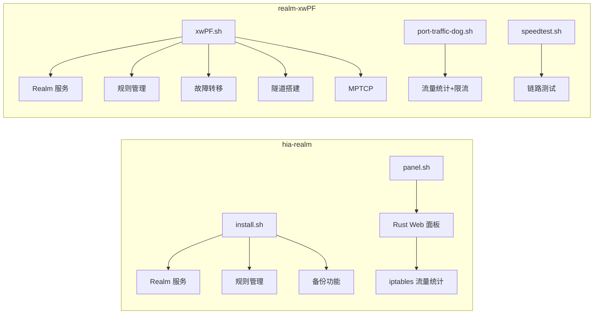

# Realm 项目对比分析报告

## 项目概览

本报告对比分析两�?Realm 端口转发管理项目�?

| 项目 | 仓库地址 | Stars | Forks |
|------|---------|-------|-------|
| **wsuming97/realm-suming** | https://github.com/wsuming97/realm-suming | - | - |
| **zywe03/realm-xwPF** | https://github.com/zywe03/realm-xwPF | 766 | 97 |

---

## 项目一：wsuming97/realm-suming（本地目录）

### 基本信息
- **位置**: `c:/Users/suto/Desktop/hia-realm-main`
- **定位**: Realm 转发脚本 + Rust Web 面板
- **语言**: Shell 脚本 + 内嵌 Rust 代码

### 文件结构
```
hia-realm-main/
├── install.sh        # 主安装脚本（896行）
├── panel.sh          # 自编�?Web 面板脚本�?013行）
├── quickpanel.sh     # 快速部署面板脚本（118行）
├── unipan.sh         # 卸载脚本�?7行）
├── test.sh           # 测试脚本
└── README.md         # 文档�?05行）
```

### 核心功能
1. **Realm 服务管理**: 一键安�?卸载/更新
2. **规则管理**: 添加/删除/修改/启停
3. **备份功能**: 定时备份、FTP/SFTP 远程备份
4. **Web 面板**: Rust/Axum 实现的可视化管理界面（菜单选项 16�?

### Web 面板详细功能

**安装方式**:
- 快速安装部署（下载预编译二进制�?
- 自编译部署（需�?Rust 编译环境�?

**默认配置**:
- 端口: `4794`
- 用户�? `admin`
- 密码: `123456`
- 访问地址: `http://<服务器IP>:4794`

**面板能力**:
- 登录鉴权（cookie session�?
- 可视化管理规则：添加 / 编辑 / 删除 / 启停
- 一键删除、批量添加、一键导�?导入
- 端口冲突检测（同端口禁止重复）
- 流量统计（通过 iptables 自定义链实现�?
- 流量限制与到期时间设�?
- 自定义设置：
  - 管理账户（用户名/密码�?
  - PC/手机端背景图 URL

**数据存储**:
- 面板数据: `/etc/realm/panel_data.json`
- Realm 配置: `/etc/realm/config.toml`（自动生�?刷新�?

**注意事项**:
- 面板将启用的规则写入 realm 配置，禁用规则不会写�?endpoints
- 若启用规则为空，面板会写入一�?keepalive 占位规则（`127.0.0.1:65534`�?

### 技术特�?
- 面板使用 Rust 语言（Axum 框架），需要编译或下载预编译二进制
- 使用 iptables 自定义链（REALM_IN/REALM_OUT）统计流�?
- 配置格式：TOML
- 支持 AMD64 �?ARM64 架构

---

## 项目二：zywe03/realm-xwPF（GitHub�?

### 基本信息
- **定位**: Realm 全功能一键网络转发管�?
- **语言**: 100% Shell 脚本（纯脚本实现�?
- **许可�?*: MIT

### 文件结构
```
realm-xwPF/
├── .github/workflows/    # GitHub Actions
├── notifications/        # 通知模块
├── LICENSE
├── README.md             # 中文文档
├── README_EN.md          # 英文文档
├── port-traffic-dog-README.md  # 端口流量狗文�?
├── port-traffic-dog.sh   # 端口流量统计脚本
├── speedtest.sh          # 速度测试脚本
├── xwFailover.sh         # 故障转移脚本
├── xwPF.sh               # 主脚�?
└── xw_realm_OCR.sh       # OCR 相关脚本
```

### 核心功能
1. **快速体�?*: 一键安装轻量上�?
2. **故障转移**: 使用系统工具自动故障检�?
3. **搭建隧道**: 双端 realm 架构支持 TLS/WS/WSS
4. **规则备注**: 清晰的备注功�?
5. **端口流量�?*: 统计端口流量、控制限速限流、通知
6. **直观配置系统 MPTCP**: 清晰展示 MPTCP 界面
7. **网络链路脚本**: 测试链路延迟、带宽、稳定性、路由情�?
8. **一键导�?导入**: 压缩包迁�?
9. **一键识别批量导�?*: 自写 realm 规则配置
10. **智能检�?*: 自动检测系统架构、端口冲突、连接可用�?
11. **完整卸载**: 分阶段全面清�?
12. **原生 Realm 全功�?*: 同步支持最新版 realm

### 高级特�?
- TCP/UDP 协议
- 单中转多出口 / 多中转单出口
- Proxy Protocol
- MPTCP 支持
- 指定入口/出口 IP 或网�?

### 工作模式
- 单端 realm 架构（常见转发）
- 双端 realm 架构（搭建隧道）
- 负载均衡 + 故障转移
- 双端 realm 调用系统 MPTCP
- 端口转发 vs 链式代理（分段代理）

---

## 功能对比矩阵

| 功能 | hia-realm | realm-xwPF |
|------|:---------:|:----------:|
| **基础转发** | �?| �?|
| TCP + UDP | �?| �?|
| IPv4 / IPv6 | �?| �?|
| **管理界面** | | |
| CLI 菜单 | �?| �?|
| Web 面板 | �?(Rust) | �?|
| **高级功能** | | |
| 故障转移 | �?| �?|
| TLS/WS/WSS 隧道 | �?| �?|
| MPTCP 支持 | �?| �?|
| Proxy Protocol | �?| �?|
| 链式代理 | �?| �?|
| 负载均衡 | �?| �?|
| **流量管理** | | |
| 流量统计 | �?(iptables) | �?(端口流量�? |
| 限速限�?| �?| �?|
| 流量通知 | �?| �?|
| **备份迁移** | | |
| 规则导入/导出 | �?| �?|
| 定时备份 | �?| �?|
| FTP/SFTP 备份 | �?| �?|
| **网络工具** | | |
| 链路测试 | �?| �?|
| 速度测试 | �?| �?|
| **部署复杂�?* | 中等（需 Rust 编译）| 低（纯脚本）|
| **社区活跃�?* | �?| �?|

---

## 架构对比�?



---

## 总结与建�?

### hia-realm 的优�?
1. **Web 面板**: 提供浏览器可视化管理
2. **远程备份**: 支持 FTP/SFTP 自动备份
3. **定时任务**: 内置 cron 定时备份

### realm-xwPF 的优�?
1. **功能全面**: 故障转移、隧道、MPTCP、链式代理等高级功能
2. **纯脚�?*: 无需编译，部署简�?
3. **社区活跃**: 766 Stars，持续维护更�?
4. **网络工具**: 内置链路测试、速度测试

### 使用场景建议
- **选择 hia-realm**: 需�?Web 可视化管理、远程备�?
- **选择 realm-xwPF**: 需要高级网络功能（故障转移、隧道、MPTCP）、追求稳定性和社区支持

---

*报告生成时间: 2026-02-03*
